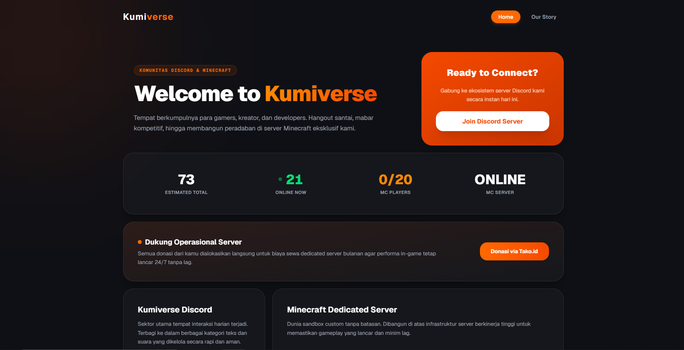

# Kumiverse Web Portal

Kumiverse Web adalah platform portal resmi berbasis web untuk komunitas Kumiverse. Platform ini berfungsi sebagai pusat informasi, landing page komunitas, serta menghubungkan anggota dengan ekosistem utama Kumiverse, termasuk Komunitas Discord dan Server Minecraft.

Aplikasi ini berjalan di lingkungan produksi dan dapat diakses secara publik melalui tautan resmi: **(https://web.kumiverse.my.id)**

---

## Status Proyek

* **Status Pengembangan:** Selesai / Production Ready
* **Fase:** Stable Release

*Catatan: Repositori ini berisi kode sumber versi produksi yang siap di-deploy secara langsung.*

---

## Fitur Utama

* **Landing Page Komunitas:** Informasi umum mengenai ekosistem Kumiverse, tautan undangan Discord, dan detail media sosial.
* **Integrasi Status Minecraft Live:** Menampilkan status server secara real-time, jumlah pemain yang sedang online, serta status server (online/offline) langsung menggunakan Minecraft Server API tanpa memerlukan penyimpanan database lokal.
* **Arsitektur Tanpa Database (Stateless):** Seluruh data bersifat dinamis dan diambil langsung dari pihak ketiga via API, membuat performa web sangat ringan dan cepat.
* **Desain Responsif:** Antarmuka modern yang dioptimalkan dengan baik menggunakan Tailwind CSS untuk kenyamanan navigasi di perangkat seluler maupun desktop.

---

## Spesifikasi Teknologi

Teknologi utama yang digunakan dalam pengembangan platform portal ini meliputi:

* **Framework:** Next.js (React)
* **Styling & UI:** Tailwind CSS
* **Data Fetching:** Native Fetch API (Mengambil data status server Minecraft secara langsung dari API publik)
* **Deployment:** Github Actions

---

## Kebutuhan Sistem

Sebelum menjalankan proyek di lingkungan lokal untuk modifikasi, pastikan perangkat Anda memenuhi spesifikasi berikut:

* Node.js v18.x atau versi yang lebih baru
* Paket manajer `npm` atau `yarn`

---

## Prosedur Instalasi & Pengoperasian Lokal

### 1. Klon Repositori
```bash
git clone https://github.com/vynts/kumiverse-web.git
cd kumiverse-web
```
